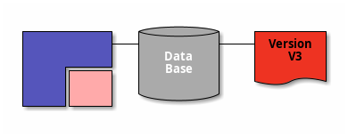

# Проектирование приложений
Проектирование проекта следует составлять на основе некоторых правил:
1. Абстракции - нужно писать такой код, чтобы человек не вдаваясь в детали реализации мог использовать написанный ранее функционал с ожидаемым поведением. Разделяйте интерфейс и определение.
2. Переиспользование кода - использовать уже написанный, протестированный функционал, а не изобретать велосипед, стараться писать общий код, используя шаблоны. Разбивайте код на логические подсистемы, используйте шаблоны, иерархию наследования

Плюсы переиспользования:
1. Так как ты используешь готовый функционал, тебе не нужно тратить время на его разработку и тестирование.
2. Функционал библиотеки постоянно улучшается, вы не тратите на это время
3. Если говорить о стандартной библиотеке STL, ее код пишется лучшими инженерами которые знают, что делают.

Минусы переиспользования:
1. Для своих нужд вы можете написать более производительный код, поскольку в библиотеках код пишется для общих случаев, но нужен ли он вам?
2. Вы знаете как реализован ваш функционал
3. Библиотеку могут перестать поддерживать
4. Обновляя библиотеку которую вы используете на проекте, могут появиться баги.

Как выбрать библиотеку
1. Понять возможности и ограничения
	1. Обеспечивает ли библиотека безопасность в многопоточных программах
	2. Нужны ли ей какие-то специфические настройки компилятора и стоит их использовать в нашем проекте
	3. Какие библиотеки она за собой тянет
2. Сколько времени пройдет для ее изучения
3. Что по производительности
	1. Стоит оценить входные данные вашей программы. Допустим $O(n^2)$ будет работать быстрее $O(log_n)$ на маленьких входных данных
4. Понять ограничения платформы - у вас кросс платформенный проект, а библиотека идет только под одну платформу
5. Лицензия
6. Будет ли оказана оперативная поддержка, допустим при нахождении бага со стороны разработчиков библиотеки

# Философия переиспользовния кода
При написании кода следует помнить следующее:
1. Write once, use often.
2. Avoid code duplication at any cost.
3. DRY—Don’t Repeat Yourself.

Несколько причин почему стоит придерживаться их:
1. Код раздувается не так сильно как мог бы
2. Экономит время и деньги(вытекает из 1)

#do/review ниже

Проектирование - моделирование отношений между типами.

